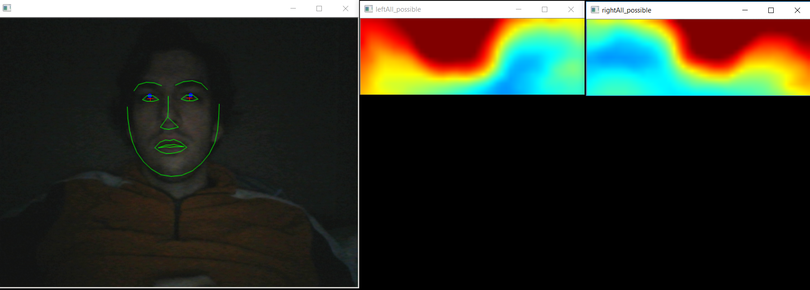
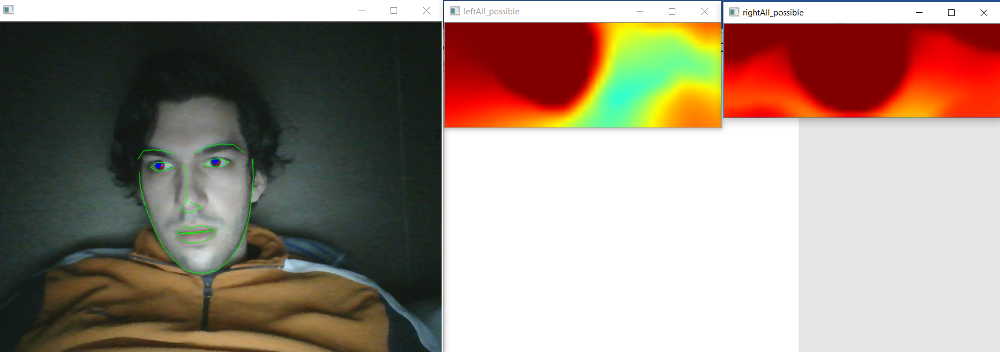
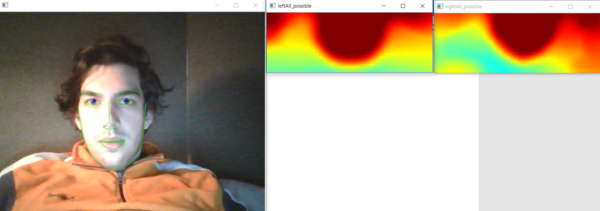
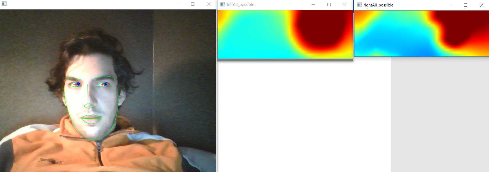
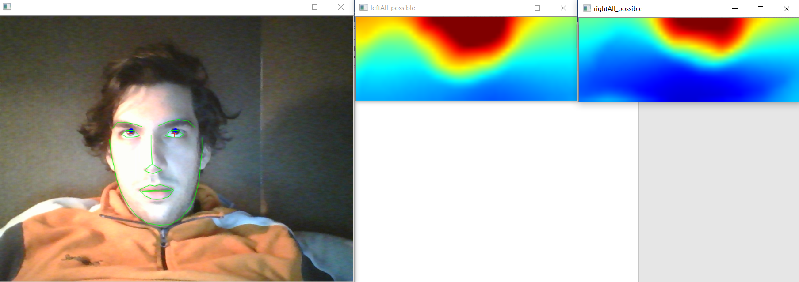

# Tracking the view
 
Darkest light from monitor: 
Brighter light from monitor: 
Straight view with additional lighting: 
Look to the right with additional lighting: 
Look to the left with additional lighting: 
Look up with additional lighting: 
A more distant face with wide open eyes: 

## Prerequisites

### Windows

- Install [CMake](https://cmake.org/download/). We recommend to add CMake to path for easier console using.
- Install [opencv 2.4](https://github.com/opencv/opencv) from sources.
    - Get OpenCV [(github)](https://github.com/opencv/opencv) and put in on C:/ (It can be installed somewhere else, but it's recommended to be close to root dir to avoid too long path error). `git clone https://github.com/opencv/opencv`
    - Checkout on 2.4 branch `git checkout 2.4`.
    - Make build directory .
    - In build directory create project with cmake or cmake-gui (enable `BUILD_EXAMPLES` for later test).
    - Open project in Visual Studio.
    - Build Debug and Release versions.
    - Build `INSTALL` project.
    - Add `opencv_dir/build/bin/Release` and `opencv_dir/build/bin/Debug` to PATH variable. 
    - Test installation by running examples in `opencv/build/install/` dir.
- Instal [DLIB](http://dlib.net/)
    - Go to Dlib folder and inside build folder follow this steps:
    - `cmake .. -G"Visual Studio 14 2015 Win64" -DCMAKE_INSTALL_PREFIX=C:\dlib\Release` 
    - `cmake --build . --config Release --target install`
    - `cmake .. -G"Visual Studio 14 2015 Win64" -DCMAKE_INSTALL_PREFIX=C:\dlib\Debug` 
    - `cmake --build . --config Debug --target install`

## Installing
```
git clone https://github.com/nejcgalof/trackingView.git
```

## Build
You can use cmake-gui or write similar like this:
```
mkdir build
cd build
cmake -G "Visual Studio 14 2015 Win64" -DOpenCV_DIR="C:/opencv/build" -DLibDRelease="C:/dlib/Release" ..
```

## References

- Tereza Soukupova and Jan Cech, Real-Time Eye Blink Detection using Facial Landmarks, 21st Computer Vision Winter Workshop,Rimske Toplice, Slovenia, February 3–5, 2016, https://vision.fe.uni-lj.si/cvww2016/proceedings/papers/05.pdf

- Fabian Timm and Erhardt Barth, ccurate eye centre localisation by means of gradients, Institute for Neuro- and Bioinformatics, University of Lubeck, Ratzeburger Allee 160, D-23538 Lubeck, Germany, http://www.inb.uni-luebeck.de/publikationen/pdfs/TiBa11b.pdf
